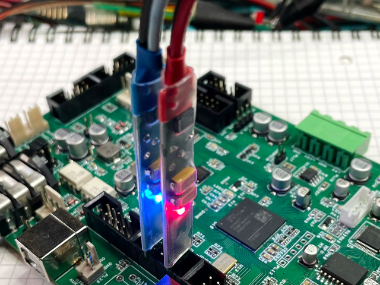

Maker Media GmbH

***

# Preiswerter FET-Tastkopf

Moderne Prozessoren und Logikbausteine schalten mit Anstiegsflanken von weniger 
als einer Nanosekunde – da ist ein schnelles Oszilloskop mit 200 MHz Bandbreite kein 
besonderer Luxus. Allerdings stößt man mit den herkömmlichen passiven Tastköpfen 
schnell an die Grenzen der Physik. Dann muss ein FET-Tastkopf her.

 

Den vollständigen Artikel gibt es in der Make 4/25.
